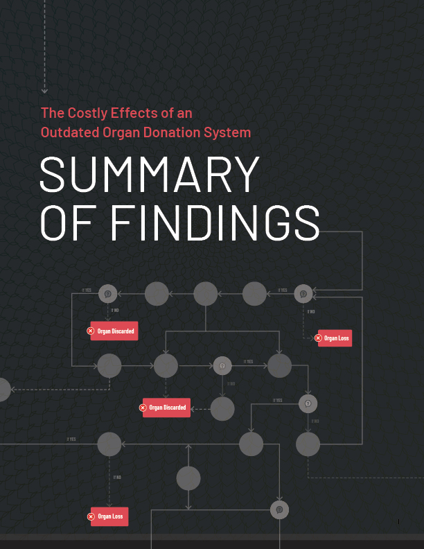

If the U.S. fixed its broken organ donation system, it could save thousands of lives and $40 billion in taxpayer money over the next decade.

Despite scientific advancements, the organ donation system is held back by poor management and performance.

Bloom Works investigated and analyzed the current organ donation system through interviews, case studies, and existing research. These reports outline what we found, and what recommendations we have for improving the system.

## Where to start? 

<!-- 
 -->
We recommend reading through our [Summary of Findings]({{ site.url }}{{ site.baseurl }}/Summary) (or you can [read the printable summary version here]({{ site.asset_url }}/assets/PDF/Summary.pdf)).

You can also view our more comprehensive reports with specific areas of focus, such as [Inequity in Organ Donation]({{ site.url }}{{ site.baseurl }}/Inequity), [OPO Best Practices]({{ site.url }}{{ site.baseurl }}/OPO-Best-Practices), [Technology Recommendations]({{ site.url }}{{ site.baseurl }}/Technology), and [Acquisition Strategy for OPTN Tech]({{ site.url }}{{ site.baseurl }}/Acquisition-Strategy). 

[The appendix has all of the maps and charts explaining the process]({{ site.url }}{{ site.baseurl }}/appendix). 

[This entire report is on github](https://github.com/Bloom-Works/organ-donation-reform). You can read, download source files, and contribute.

